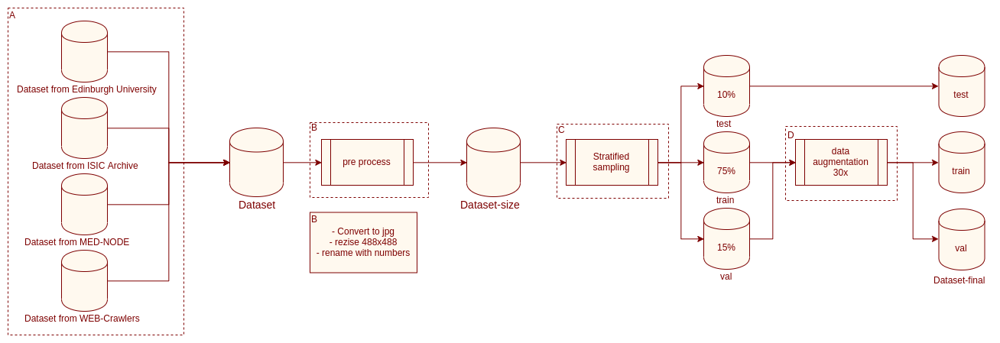

# Dados



O pipe da imagem acima mostra todo o fluxo de manipulação de dados.

## 0 - Coleta de dados

Foram coletados dados de 4 bases diferentes de 9 lesões. Usando o notebook ```0-mded-node-dataset.ipynb```

## 1 - Web Crawler

Foi feito uma extração em sites especificos de referência para criar uma base complementar. Usando o notebook ```1-web-crawler.ipynb```


## Pre processamento

Foi feito um preprocessamento de ajustar as imagens para a mesma dimensão e fazer complemento de cinza para imagens quadradas, foi renomeado sequenciamente todas as imagens e convertidas para .jpeg, Usando o notebook ```2-pre-process-images.ipynb```

## Separação

Foi feito uma sepração estratificada dos dados onde usando a seed=12345, com porcentagem de 75% para treino, 15% para validação e 10% para teste. Usando o notebook ```3-stratified-slipt.py ``` 

## Augmentation

Para melhorar a base de dados foi usado uma tecnica de criação de dados sinteticos baseado nos dados ja coletados. ```4-data-augmentation-29x.py``` 

## Dados final

Assim obteve-se dados para treino de uma rede neural de 9 classes de lesões de peles diferentes.
