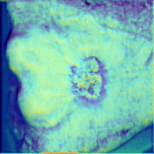
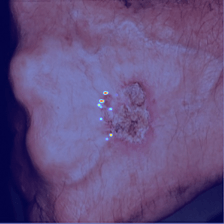
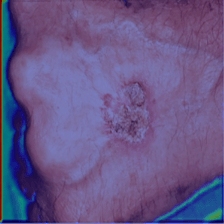
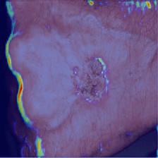
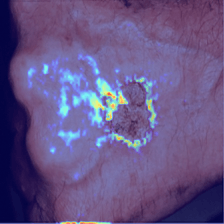

# Figura 39

(a)

(b)

(c)

(d)

(e)

Figura 39 - Grad-CAM. Imagens sequenciais das saídas da camada ReLu, layer1, Layer2, Layer3 e Layer4 em sequência. (a) Intraepithelial Carcinoma a classe predita pelo modelo, (b) Squamous cell Carcinoma a verdadeira classe da imagem, (c) Malignant Melanoma, (d) Basal Cell Carcinoma e (e) Actinic Keratosis.
