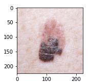

# Figura 50

Figura 50 - Grad-CAM de toda a rede neural, com a classificação sendo Squamous cell Carcinoma e a real classe é Malignant Melanoma. São 50 imagens sequenciais das saídas da terceira camada convolucional de cada bloco da rede neural.