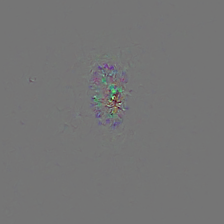
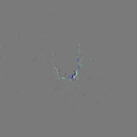
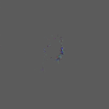
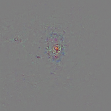

# Figura 53

(a)

(b)

(c)

(d)

(e)

Figura 53 - Guided Grad-CAM, verdadeiro-positivo. As imagens das saídas das camadas ReLu, layer1, Layer2, Layer3 e Layer4 em sequência. (a) Malignant Melanoma a classe predita pelo modelo e a real classe da imagem, (b) Melanocytic Nevus, (c) Hemangioma, (d) Dermatofibroma e (e) Basal Cell Carcinoma.