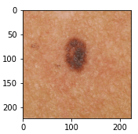

# Figura 55

Figura 55 - Grad-CAM de toda a rede neural, com a classificação correspondendo a real classe: Malignant Melanoma. São 50 imagens sequenciais das saídas da terceira camada convolucional de cada bloco da rede neural.