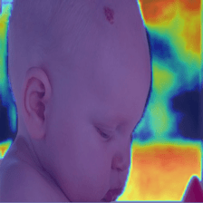
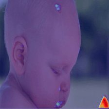
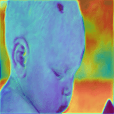
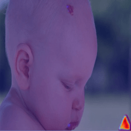

# Figura 59

(a)

(b)

(c)

(d)

(e)

Figura 59 - Grad-CAM, verdadeiro-positivo com possível \textit{overfitting}. As imagens das saídas das camadas ReLu, layer1, Layer2, Layer3 e Layer4 em sequência. (a) Hemangioma a classe predita pelo modelo e a real classe da imagem, (b) Pyogenic Granuloma, (c) Melanocytic Nevus, (d) Basal Cell Carcinoma e (e) Squamous Cell Carcinoma.