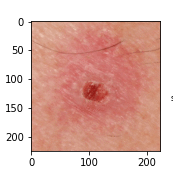

# Figura 36

Figura 36 - Grad-CAM de toda a rede neural, com a classificação sendo Basal Cell Carcinoma. São 50 imagens sequenciais das saídas da terceira camada convolucional de cada bloco da rede neural.
