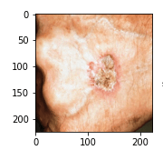

# Figura 10

Figura 40 - Grad-CAM de toda a rede neural, com a classificação dada como Intraepithelial Carcinoma, contudo a verdadeira classe é Squamous cell Carcinoma. São 50 imagens sequenciais das saídas da terceira camada convolucional de cada bloco da rede neural.