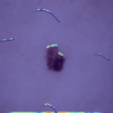
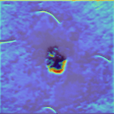
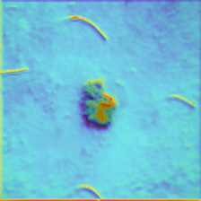
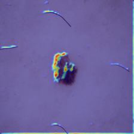
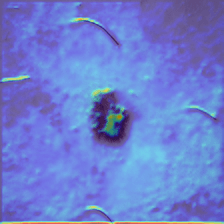

# Figura 44

(a)

(b)

(c)

(d)

(e)

Figura 44 - Grad-CAM. Imagens sequenciais das saídas da camada ReLu, layer1, Layer2, Layer3 e Layer4 em sequência. (a) Squamous cell Carcinoma a classe predita pelo modelo e classe real da imagem, (b) Malignant Melanoma, (c) Basal Cell Carcinoma, (d) Dermatofibroma e (e) Melanocytic nevus.