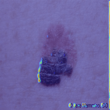
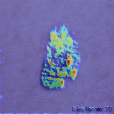
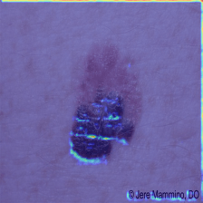
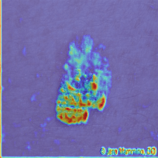
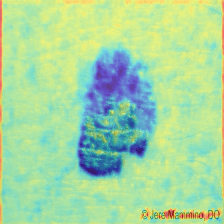

# Figura 49

(a)

(b)

(c)

(d)

(e)

Figura 49 - Grad-CAM, Falso-positivo. As imagens das saídas da camada ReLu, layer1, Layer2, Layer3 e Layer4 em sequência. (a) Squamous cell Carcinoma a classe predita pelo modelo, (b) Basal Cell Carcinoma, (c) Intraepithelial Carcinoma, (d) Malignant Melanoma real classe da imagem e (e) Melanocytic Nevus.