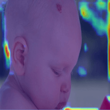

# Figura 60

Figura 60 - Grad-CAM de toda a rede neural, com a classificação correspondendo a real classe: Hemangioma. São 50 imagens sequenciais das saídas da terceira camada convolucional de cada bloco da rede neural.