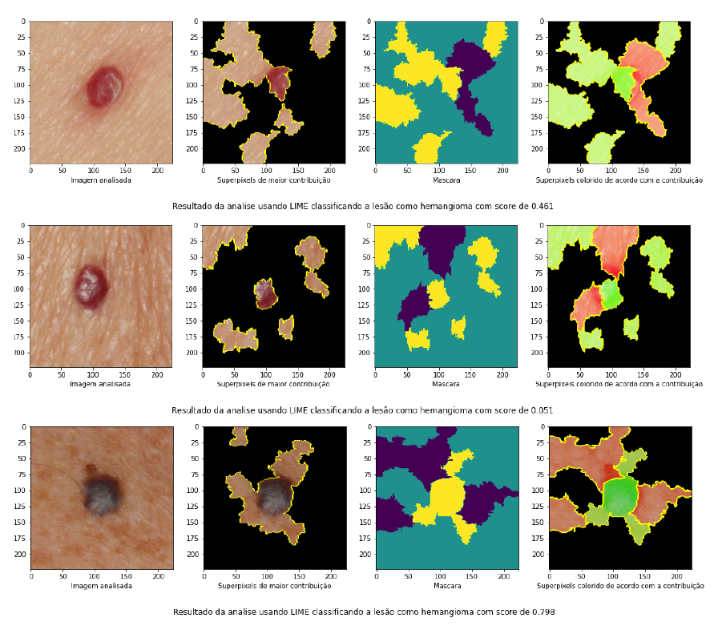
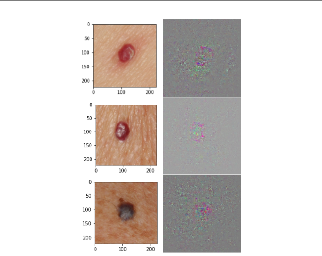
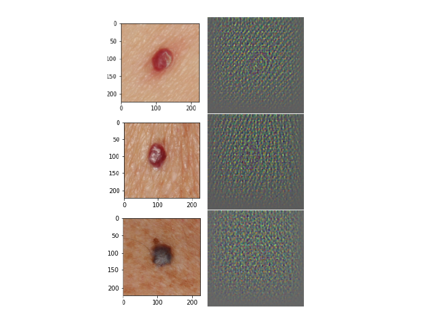
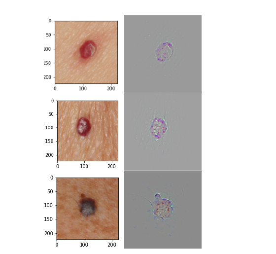
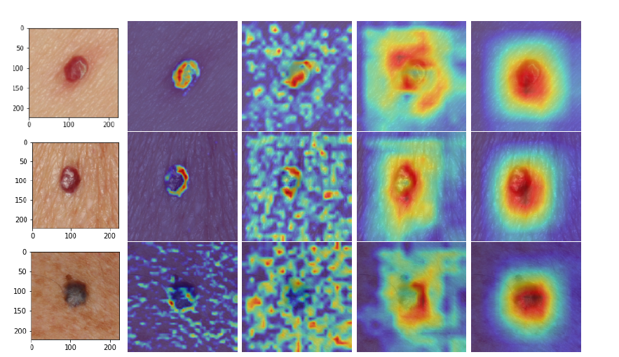
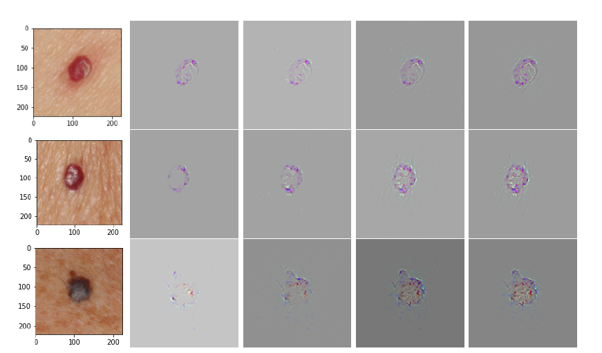

# Aplicação de técnicas de XAI em redes neurais convolucionais na classificação de lesões de pele 
### Disciplina: Topicos Especiais de Engenharia de Software 
### Professor: Diego Luiz Dorgam Aguilera  

## Integrantes

| Nome               | Matrícula  | GitHub             |
|--------------------|------------|--------------------|
| João Vitor R Baptista     | 15/0013329 | @helpthx         |

## O Projeto

Como a utilização de diferentes técnicas de XAI fornecem insumos para a interpretabilidade de uma rede neural convolucional aplicada na classificação de lesões de pele.

Foi desenvolvido uma rede neural convolucional que classifica 9 lesões diferentes e nessa rede neural foram aplicados 2 grandes tecnicas de XAI. LIME e Tenicas baseada no calculo do gradient.

## Objetivos

### Objetivo geral:
Implementar, comparar e discutir diferentes técnicas de XAI em uma rede neural convolucional aplicada na classificação de lesões de pele.

### Objetivos específicos:
* Modelar uma rede neural convolucional para classificar lesões de pele. 
* Aplicar duas técnicas de XAI no modelo desenvolvido. 
* Discutir e comparar as técnicas e resultados das técnicas aplicadas.

## Desenvolvimento

* Na pasta 0-Dados/ estão todos os artefatos de manipulação dos dados do projeto, extratificação dos dados, data augmentation e etc.
* Na pasta 1-Modelo/ estão os artefatos de desenvolvimento do modelo, transfer learning, as metricas avaliadas e experimentos.
* Na pasta 2-Interpretability/ estão os artefatos para implementação das tecnicas de interperpretabilidade e os experimentos.
* * Na pasta 3-trabalho/ estão os artefatos escritos e apresentação do trabalho.

## Tecnologias
### Requisitos para execução do código

É necessário ter as seguintes bibliotecas instaladas para a execução do projeto, além do Python 3.7+:

* [PyTorch](https://pytorch.org/) - **1.3.1**

* [Torchvision](https://pytorch.org/) - **0.4.2**

## Citação 
This is a academic project so if you want to replicate or use any code. Just cite this work.

```
@misc{jvrbaptista,
  author = {Baptista, João and Silva, Nilton},
  title = {XAI techniques applied on convolutional neural network for skin lesion classification},
  year = {2021},
  publisher = {GitHub},
  journal = {GitHub repository},
  howpublished = {\url{https://github.com/helpthx/TCC-2-UnB}},
}
```

## Visualizações 
Tecnicas aplicadas e discutidas no presente trabalho.
### LIME


### Gradient-Based
#### Valina Gradient


#### Deconvnet


#### Guided Backpropagation


#### Grad-CAM


#### Guided Grad-CAM

## Open Source [](https://github.com/ellerbrock/open-source-badges/)

- [Contribution Guide](./contributing.md)
- [Style Guide](./STYLE_GUIDE.md)
- [Code of Conduct](./CODE_OF_CONDUCT.md

